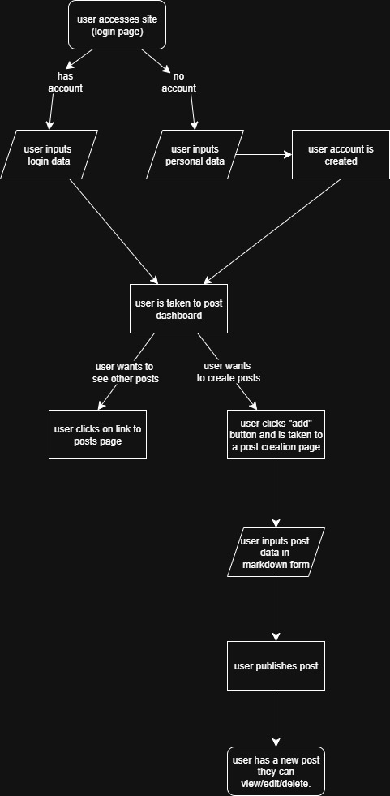
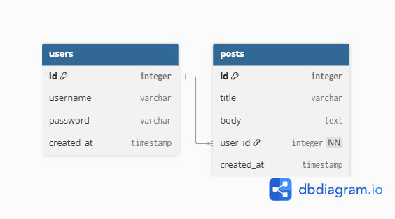
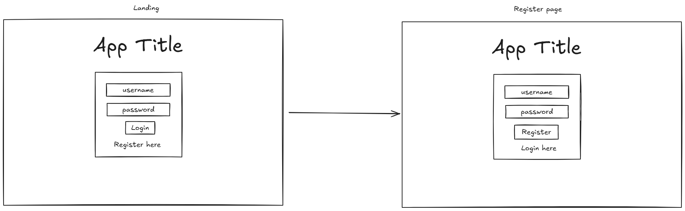
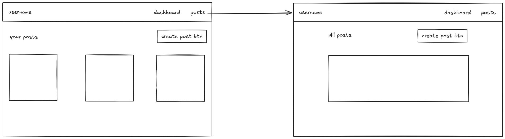
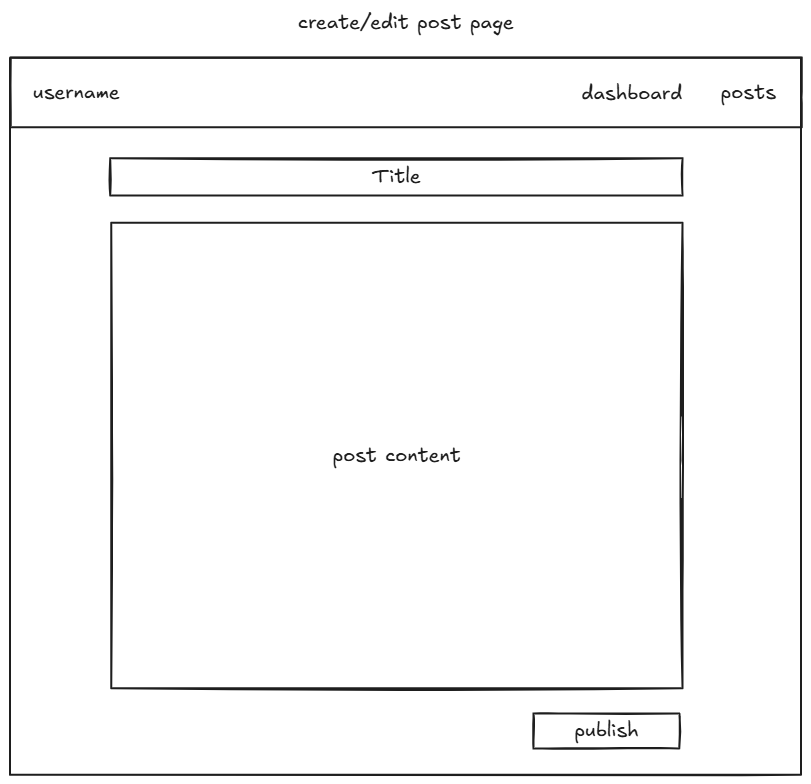

# M-blog

The aim is to create a blog that utilises the markdown format for post formatting. 

## Requirements

- users can create and delete their personal account
- users can create, read, update and delete posts using markdown

## Project flowchart

## Project ERD

## Project Wireframe

### Landing/registration page

### Dashboard/all posts page

### Create/edit posts page

## Final Output

